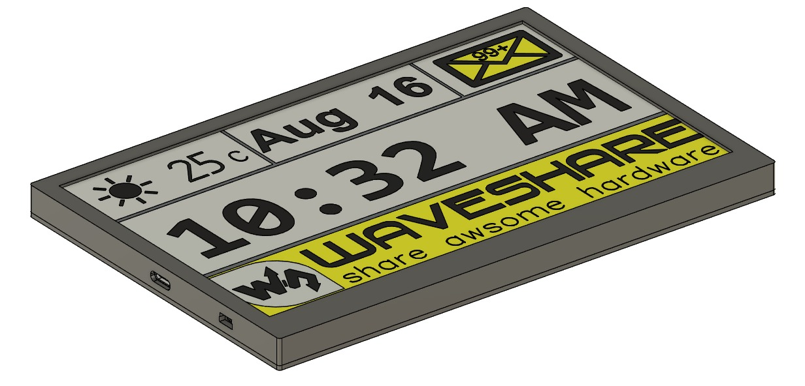
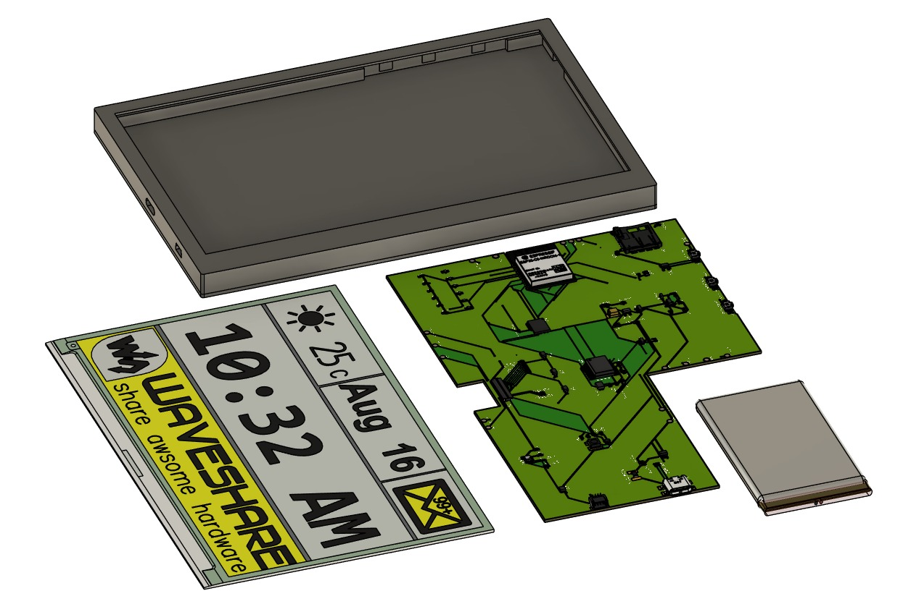
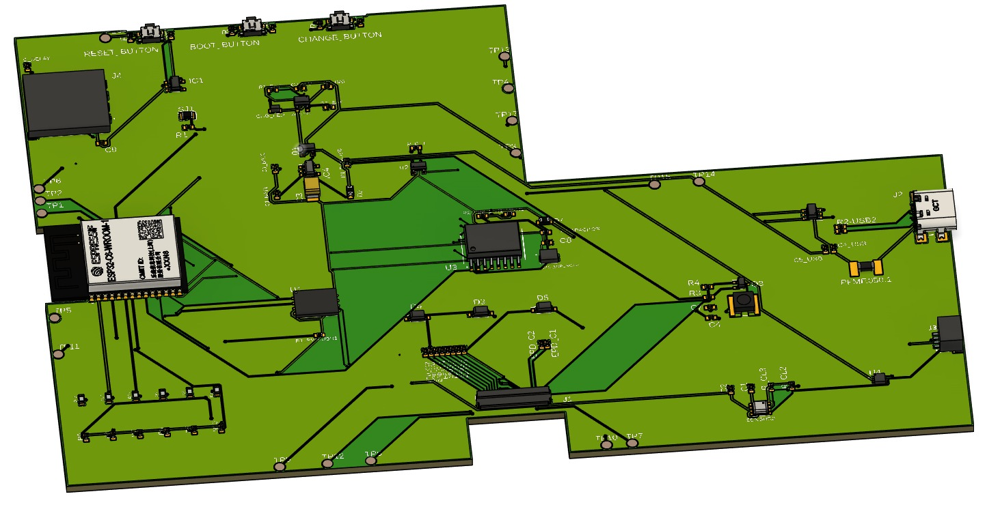
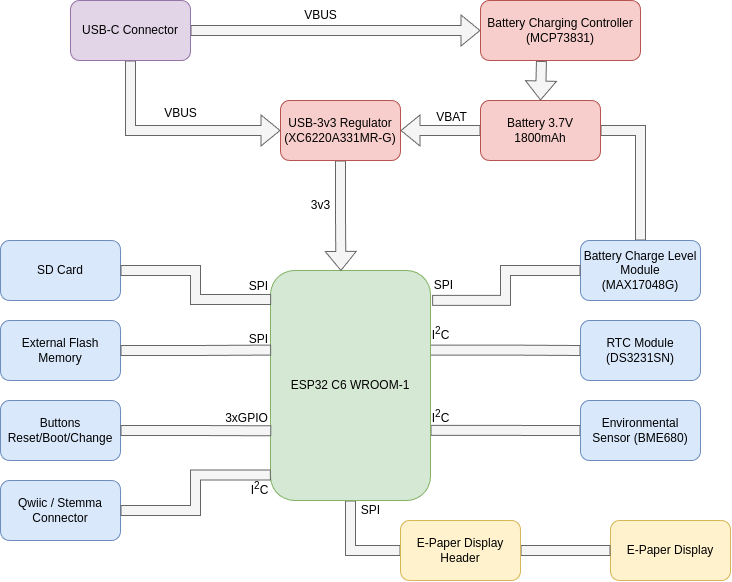

# eBook Project - Autodesk Fusion 360 

## Images

*Complete View*

*Exploded View*

*PCB*

## Block Diagram

## Bill of Materials

| Component | Description | Datasheet | Shop |
|-----------|-------------|-----------|------|
| ESP32-C6-WROOM-1-N8 | Wi-Fi, BLE, Zigbee SoC Module | [Datasheet](https://www.espressif.com/sites/default/files/documentation/esp32-c6-wroom-1_wroom-1u_datasheet_en.pdf) | [Shop](https://eu.mouser.com/ProductDetail/Espressif-Systems/ESP32-C6-WROOM-1U-N8?qs=1Kr7Jg1SGW%2FzPU4G%252ByMwkA%3D%3D) |
| MCP73831 | Li-Po Battery Charging Controller | [Datasheet](https://eu.mouser.com/datasheet/2/268/MCP73831_Family_Data_Sheet_DS20001984H-3441711.pdf) | [Shop](https://eu.mouser.com/ProductDetail/Microchip-Technology/MCP73831T-2ACI-OT?qs=yUQqVecv4qvbBQBGbHx0Mw%3D%3D) |
| XC6220A331MR-G | LDO Voltage Regulator | [Datasheet](https://eu.mouser.com/datasheet/2/760/xc6220-3371556.pdf) | [Shop](https://eu.mouser.com/ProductDetail/Torex-Semiconductor/XC6220A331MR-G?qs=AsjdqWjXhJ8ZSWznL1J0gg%3D%3D) |
| BME680 | Environmental Sensor | [Datasheet](https://eu.mouser.com/datasheet/2/783/BST_BME680_DS001-1509608.pdf) | [Shop](https://eu.mouser.com/ProductDetail/Bosch-Sensortec/BME680?qs=v271MhAjFHjo0yA%2FC4OnDQ%3D%3D) |
| DS3231SN | Real-Time Clock | [Datasheet](https://eu.mouser.com/datasheet/2/609/DS3231-3421123.pdf) | [Shop](https://eu.mouser.com/ProductDetail/Analog-Devices-Maxim-Integrated/DS3231SN?qs=1eQvB6Dk1vhUlr8%2FOrV0Fw%3D%3D) |
| MAX17048G+T10 | Battery Fuel Gauge | [Datasheet](https://eu.mouser.com/datasheet/2/609/MAX17048_MAX17049-3469099.pdf) | [Shop](https://eu.mouser.com/ProductDetail/Analog-Devices-Maxim-Integrated/MAX17048G%2bT10?qs=D7PJwyCwLAoGnnn8jEPRBQ%3D%3D) |
| W25Q512JVEIQ | 512Mb Flash Memory | [Datasheet](https://eu.mouser.com/datasheet/2/949/Winbond_W25Q512JV_Datasheet-3240039.pdf) | [Shop](https://eu.mouser.com/ProductDetail/Winbond/W25Q512JVEIQ?qs=l7cgNqFNU1jw6svr3at6tA%3D%3D) |
| USB4110-GF-A | USB Type-C Connector | [Datasheet](https://eu.mouser.com/datasheet/2/837/GCT_USB4110_Product_Drawing___20k_cycles-3455479.pdf) | [Shop](https://eu.mouser.com/ProductDetail/GCT/USB4110-GF-A?qs=KUoIvG%2F9IlYiZvIXQjyJeA%3D%3D) |
| 112A-TAAR-R03 | Micro SD Card Connector | [Datasheet](https://www.attend.com.tw/data/download/file/112A-TAAR-R03_Spec.pdf) | [Shop](https://www.tme.eu/ro/details/mcc-sdmicro/conectori-pentru-cartele/attend/112a-taar-r03/) |
| SI1308EDL-T1-GE3 | N-Channel MOSFET | [Datasheet](https://www.vishay.com/docs/63399/si1308edl.pdf) | [Shop](https://eu.mouser.com/ProductDetail/Vishay-Semiconductors/SI1308EDL-T1-GE3?qs=bX1%252BNvsK%2FBramh9tgpOaEw%3D%3D) |
| DMG2305UX-7 | P-Channel MOSFET | [Datasheet](https://www.diodes.com/assets/Datasheets/DMG2305UX.pdf) | [Shop](https://eu.mouser.com/ProductDetail/Diodes-Incorporated/DMG2305UX-7?qs=L1DZKBg7t5F%2FNBHrjfxC%252Bg%3D%3D) |
| USBLC6-2SC6Y | USB ESD Protection | [Datasheet](https://eu.mouser.com/datasheet/2/389/usblc6_2sc6y-1852505.pdf) | [Shop](https://eu.mouser.com/ProductDetail/STMicroelectronics/USBLC6-2SC6Y?qs=gNDSiZmRJS%2FOgDexvXkdow%3D%3D) |
| CPH3225 | 11mF Supercapacitor | [Datasheet](https://eu.mouser.com/datasheet/2/360/Seiko_Instruments_MicroBattery_E_20230330_2024Jan_-3561061.pdf) | [Shop](https://eu.mouser.com/ProductDetail/Seiko-Semiconductors/CPH3225A?qs=3etwrb1wR%252BhUOph6lAO7eg%3D%3D) |
| Waveshare Display | 7.5" E-Ink | [Datasheet](https://files.waveshare.com/upload/6/60/7.5inch_e-Paper_V2_Specification.pdf) | [Shop](https://www.waveshare.com/7.5inch-e-paper-hat.htm) |
| Cellevia Battery | Polymer Lithium-Ion | [Datasheet](https://www.tme.eu/Document/e0683d8c34e6d878124489f71bffb6ee/cel0014.pdf) | [Shop](https://www.emag.ro/acumulator-litiu-polymer-cellevia-3-7v-1800mah-accu-lp364778-c/pd/DVCNMRBBM/) | 
| MBR0530 | Schottky Diode | [Datasheet](https://www.onsemi.com/download/data-sheet/pdf/mbr0530t1-d.pdf) | [Shop](https://eu.mouser.com/ProductDetail/onsemi/MBR0530T3G?qs=3JMERSakebpEmdUS6GetdQ%3D%3D) |
| CC0402 | Capacitor | [Datasheet](https://eu.mouser.com/datasheet/2/447/upy_gphc_x5r_4v_to_50v-3461255.pdf) | [Shop](https://eu.mouser.com/ProductDetail/YAGEO/CC0402KRX5R6BB105?qs=BKNoF%2F0xMNu0TvpE6ze2Iw%3D%3D) | 
| RR0402 | Resistor | [Datasheet](https://www.vishay.com/docs/28952/mcs0402at-mct0603at-mcu0805at-mca1206at.pdf) | [Shop](https://eu.mouser.com/ProductDetail/Vishay-Beyschlag/MCS0402MD1002BE100?qs=sGAEpiMZZMvdGkrng054twsDrRiZGhrjpqs%252BW5FxlP8%3D) |

## Hardware Functionality

### Power Management
The device can be powered in multiple ways:
- **USB Power**: Through USB-C connector (USB4110-GF-A) with ESD protection (USBLC6-2SC6Y)
- **LiPo Battery**: Charged via MCP73831 controller with status LED
- **Supercapacitor Backup**: CPH3225A for maintaining functionality during power transitions

The power path includes:
- XC6220A331MR-G LDO provides stable 3.3V to the system
- MAX17048G+T10 monitors battery capacity
- P-channel MOSFETs (DMG2305UX-7) for power path selection
- Schottky diodes (MBR0530) for reverse voltage protection

### Processing & Memory
- **ESP32-C6-WROOM-1-N8**: Main microcontroller with Wi-Fi 6, Bluetooth 5, and Zigbee 3.0 capabilities
- **W25Q512JVEIQ**: 512Mb external SPI flash memory for data storage
- **SD Card Slot**: For user data storage and expansion

### Display System
- 7.5 inch E-Paper display interfaced via SPI
- Multiple capacitors for drive stability and voltage management

### Sensors
- **BME680/BME688**: I²C environmental sensor measuring:
    - Temperature: -40 to +85°C
    - Humidity: 0-100% RH
    - Pressure: 300-1100 hPa
    - Air Quality (gas resistance)
- **DS3231SN**: Highly accurate I²C real-time clock with temperature compensation

### Connectivity
- **USB-C**: For programming, data transfer, and charging
- **Qwiic/STEMMA QT**: I²C connector for external sensors/accessories
- **SD Card**: For data storage expansion

### User Interface
- **Reset Button**: For restarting the system
- **Boot Button**: For entering bootloader mode
- **Change Button**: For user interaction with the displayed content

## ESP32-C6 Pinout Configuration

| ESP32-C6 Pin | Function | Connected Component | Interface |
|--------------|----------|---------------------|-----------|
| EN | Reset | RESET_BUTTON | Digital Input |
| GPIO 0 | INT_RTC | DS3231SN | Interrupt |
| GPIO 1 | 32 khz | DS3231SN | Clock Output |
| GPIO 2 | MISO | SPI Bus | SPI |
| GPIO 3 | E-Paper BUSY | E-Paper Display | Digital Input |
| GPIO 4 | SD Card CS | SD Card Slot | SPI |
| GPIO 5 | E-Paper DC | E-Paper Display | Digital Output |
| GPIO 6 | SCK - Clock | SPI Bus | SPI |
| GPIO 7 | MOSI | SPI Bus | SPI |
| GPIO 9 | IO/Boot | BOOT_BUTTON | Digital Input |
| GPIO 10 | E-Paper CS | E-Paper Display | SPI |
| GPIO 11 | Flash CS | W25Q512JVEIQ | SPI |
| GPIO 12 | USB_D- | USB Interface | USB |
| GPIO 13 | USB_D+ | USB Interface | USB |
| GPIO 15 | IO/Change | CHANGE_BUTTON | Digital Input |
| GPIO 16 | TX | USB-to-Serial | UART |
| GPIO 17 | RX | USB-to-Serial | UART |
| GPIO 18 | RTC Reset | DS3231SN | Digital Output |
| GPIO 19 | I2C_PW | I²C Power Control | Digital Output |
| GPIO 20 | EPD_3V3_C | E-Paper Display Power | Power Control |
| GPIO 21 | SDA | I²C Bus (BME680, RTC) | I²C |
| GPIO 22 | SCL | I²C Bus (BME680, RTC) | I²C |
| GPIO 23 | E-Paper RESET | E-Paper Display | Digital Output |

