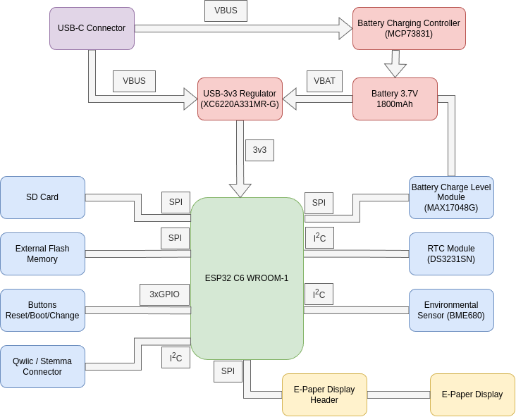
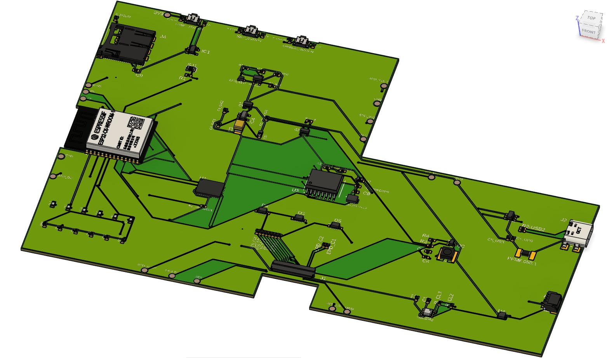

# eBook Project

## Block Diagram

## Bill of Materials

| Component | Description | Manufacturer | Datasheet | Shop |
|-----------|-------------|--------------|-----------|------|
| ESP32-C6-WROOM-1-N8 | Wi-Fi, BLE, Zigbee SoC Module | Espressif Systems | [Datasheet](https://www.espressif.com/sites/default/files/documentation/esp32-c6-wroom-1_wroom-1u_datasheet_en.pdf) | [Shop](https://eu.mouser.com/ProductDetail/Espressif-Systems/ESP32-C6-WROOM-1U-N8?qs=1Kr7Jg1SGW%2FzPU4G%252ByMwkA%3D%3D) |
| MCP73831 | Li-Po Battery Charging Controller | Microchip | [Datasheet](https://eu.mouser.com/datasheet/2/268/MCP73831_Family_Data_Sheet_DS20001984H-3441711.pdf) | [Shop](https://eu.mouser.com/ProductDetail/Microchip-Technology/MCP73831T-2ACI-OT?qs=yUQqVecv4qvbBQBGbHx0Mw%3D%3D) |
| XC6220A331MR-G | LDO Voltage Regulator | Torex | [Datasheet](https://eu.mouser.com/datasheet/2/760/xc6220-3371556.pdf) | [Shop](https://eu.mouser.com/ProductDetail/Torex-Semiconductor/XC6220A331MR-G?qs=AsjdqWjXhJ8ZSWznL1J0gg%3D%3D) |
| BME680 | Environmental Sensor | Bosch Sensortec | [Datasheet](https://eu.mouser.com/datasheet/2/783/BST_BME680_DS001-1509608.pdf) | [Shop](https://eu.mouser.com/ProductDetail/Bosch-Sensortec/BME680?qs=v271MhAjFHjo0yA%2FC4OnDQ%3D%3D) |
| DS3231SN | Real-Time Clock | Analog Devices | [Datasheet](https://eu.mouser.com/datasheet/2/609/DS3231-3421123.pdf) | [Shop](https://eu.mouser.com/ProductDetail/Analog-Devices-Maxim-Integrated/DS3231SN?qs=1eQvB6Dk1vhUlr8%2FOrV0Fw%3D%3D) |
| MAX17048G+T10 | Battery Fuel Gauge | Analog Devices | [Datasheet](https://eu.mouser.com/datasheet/2/609/MAX17048_MAX17049-3469099.pdf) | [Shop](https://eu.mouser.com/ProductDetail/Analog-Devices-Maxim-Integrated/MAX17048G%2bT10?qs=D7PJwyCwLAoGnnn8jEPRBQ%3D%3D) |
| W25Q512JVEIQ | 512Mb Flash Memory | Winbond | [Datasheet](https://eu.mouser.com/datasheet/2/949/Winbond_W25Q512JV_Datasheet-3240039.pdf) | [Shop](https://eu.mouser.com/ProductDetail/Winbond/W25Q512JVEIQ?qs=l7cgNqFNU1jw6svr3at6tA%3D%3D) |
| USB4110-GF-A | USB Type-C Connector | GCT | [Datasheet](https://eu.mouser.com/datasheet/2/837/GCT_USB4110_Product_Drawing___20k_cycles-3455479.pdf) | [Shop](https://eu.mouser.com/ProductDetail/GCT/USB4110-GF-A?qs=KUoIvG%2F9IlYiZvIXQjyJeA%3D%3D) |
| 112A-TAAR-R03 | Micro SD Card Connector | ATTEND | [Datasheet](https://www.attend.com.tw/data/download/file/112A-TAAR-R03_Spec.pdf) | [Shop](https://www.tme.eu/ro/details/mcc-sdmicro/conectori-pentru-cartele/attend/112a-taar-r03/) |
| SI1308EDL-T1-GE3 | N-Channel MOSFET | Vishay Siliconix | [Datasheet](https://www.vishay.com/docs/63399/si1308edl.pdf) | [Shop](https://eu.mouser.com/ProductDetail/Vishay-Semiconductors/SI1308EDL-T1-GE3?qs=bX1%252BNvsK%2FBramh9tgpOaEw%3D%3D) |
| DMG2305UX-7 | P-Channel MOSFET | Diodes Inc | [Datasheet](https://www.diodes.com/assets/Datasheets/DMG2305UX.pdf) | [Shop](https://eu.mouser.com/ProductDetail/Diodes-Incorporated/DMG2305UX-7?qs=L1DZKBg7t5F%2FNBHrjfxC%252Bg%3D%3D) |
| USBLC6-2SC6Y | USB ESD Protection | STMicroelectronics | [Datasheet](https://eu.mouser.com/datasheet/2/389/usblc6_2sc6y-1852505.pdf) | [Shop](https://eu.mouser.com/ProductDetail/STMicroelectronics/USBLC6-2SC6Y?qs=gNDSiZmRJS%2FOgDexvXkdow%3D%3D) |
| CPH3225 | 11mF Supercapacitor | Seiko Instruments | [Datasheet](https://eu.mouser.com/datasheet/2/360/Seiko_Instruments_MicroBattery_E_20230330_2024Jan_-3561061.pdf) | [Shop](https://eu.mouser.com/ProductDetail/Seiko-Semiconductors/CPH3225A?qs=3etwrb1wR%252BhUOph6lAO7eg%3D%3D) |
| GDEW075T7 | 7.5" E-Ink Display | Good Display | [Datasheet](https://www.good-display.com/companyfile/203.html) | [Shop](https://buy-lcd.com/products/7-5inch-e-paper-display-hat-800x480-e-ink-display-module-for-raspberry-pi-two-color-black-white-spi-interface) |
| MBR0530 | Schottky Diode | ON Semiconductor | [Datasheet](https://www.onsemi.com/pdf/datasheet/mbr0530-d.pdf) | [Shop](https://eu.mouser.com/ProductDetail/ON-Semiconductor/MBR0530T1G?qs=4v%252BiZTmLDTLn2UFsjGrPzQ%3D%3D) |
| PTS645SM43SMTR92 | Tactile Switch | C&K | [Datasheet](https://www.ckswitches.com/media/1471/pts645.pdf) | [Shop](https://eu.mouser.com/ProductDetail/CK/PTS645SM43SMTR92?qs=7x9pc%252BnMhdmPG0bRdB7kNw%3D%3D) |
| SM04B-SRSS-TB | JST SH Connector (Qwiic) | JST | [Datasheet](https://www.jst-mfg.com/product/pdf/eng/eSH.pdf) | [Shop](https://eu.mouser.com/ProductDetail/JST/SM04B-SRSS-TB-LF-SN?qs=ph4zPCVRuvqoDX7hrEW%2F1w%3D%3D) |
| RC0603FR-0710KL | 10K Resistor | YAGEO | [Datasheet](https://www.yageo.com/upload/media/product/productsearch/datasheet/rchip/PYu-RC_Group_51_RoHS_L_11.pdf) | [Shop](https://eu.mouser.com/ProductDetail/YAGEO/RC0603FR-0710KL?qs=grNVXhxt7bSFqBvqM5TNiA%3D%3D) |
| CL10A226MQ8NRNC | 22µF Capacitor | Samsung | [Datasheet](https://product.samsungsem.com/mlcc/CL10A226MQ8NRNC.do) | [Shop](https://eu.mouser.com/ProductDetail/Samsung-Electro-Mechanics/CL10A226MQ8NRNC?qs=X6jEic%2FHinDCMoFPEVA%2Ftg%3D%3D) |
| BQ25606RTWT | Battery Management IC | Texas Instruments | [Datasheet](https://www.ti.com/lit/ds/symlink/bq25606.pdf) | [Shop](https://eu.mouser.com/ProductDetail/Texas-Instruments/BQ25606RTWT?qs=ulEaXIWI0c8jMVK3GKc0mQ%3D%3D) |
| LSM6DSO | 6-Axis IMU | STMicroelectronics | [Datasheet](https://www.st.com/resource/en/datasheet/lsm6dso.pdf) | [Shop](https://eu.mouser.com/ProductDetail/STMicroelectronics/LSM6DSOXTR?qs=y6ZabgHbY%252ByuJ8mSwxpV0A%3D%3D) |

| Component | Description | Manufacturer | Datasheet | Shop |
|-----------|-------------|--------------|-----------|------|
| ESP32-C6-WROOM-1-N8 | Wi-Fi, BLE, Zigbee SoC Module | Espressif Systems | [Datasheet](https://www.espressif.com/sites/default/files/documentation/esp32-c6-wroom-1_wroom-1u_datasheet_en.pdf) | [Shop](https://eu.mouser.com/ProductDetail/Espressif-Systems/ESP32-C6-WROOM-1U-N8?qs=1Kr7Jg1SGW%2FzPU4G%252ByMwkA%3D%3D) |
| MCP73831 | Li-Po Battery Charging Controller | Microchip | [Datasheet](https://eu.mouser.com/datasheet/2/268/MCP73831_Family_Data_Sheet_DS20001984H-3441711.pdf) | [Shop](https://eu.mouser.com/ProductDetail/Microchip-Technology/MCP73831T-2ACI-OT?qs=yUQqVecv4qvbBQBGbHx0Mw%3D%3D) |
| XC6220A331MR-G | LDO Voltage Regulator | Torex | [Datasheet](https://eu.mouser.com/datasheet/2/760/xc6220-3371556.pdf) | [Shop](https://eu.mouser.com/ProductDetail/Torex-Semiconductor/XC6220A331MR-G?qs=AsjdqWjXhJ8ZSWznL1J0gg%3D%3D) |
| BME680 | Environmental Sensor | Bosch Sensortec | [Datasheet](https://eu.mouser.com/datasheet/2/783/BST_BME680_DS001-1509608.pdf) | [Shop](https://eu.mouser.com/ProductDetail/Bosch-Sensortec/BME680?qs=v271MhAjFHjo0yA%2FC4OnDQ%3D%3D) |
| DS3231SN | Real-Time Clock | Analog Devices | [Datasheet](https://eu.mouser.com/datasheet/2/609/DS3231-3421123.pdf) | [Shop](https://eu.mouser.com/ProductDetail/Analog-Devices-Maxim-Integrated/DS3231SN?qs=1eQvB6Dk1vhUlr8%2FOrV0Fw%3D%3D) |
| MAX17048G+T10 | Battery Fuel Gauge | Analog Devices | [Datasheet](https://eu.mouser.com/datasheet/2/609/MAX17048_MAX17049-3469099.pdf) | [Shop](https://eu.mouser.com/ProductDetail/Analog-Devices-Maxim-Integrated/MAX17048G%2bT10?qs=D7PJwyCwLAoGnnn8jEPRBQ%3D%3D) |
| W25Q512JVEIQ | 512Mb Flash Memory | Winbond | [Datasheet](https://eu.mouser.com/datasheet/2/949/Winbond_W25Q512JV_Datasheet-3240039.pdf) | [Shop](https://eu.mouser.com/ProductDetail/Winbond/W25Q512JVEIQ?qs=l7cgNqFNU1jw6svr3at6tA%3D%3D) |
| USB4110-GF-A | USB Type-C Connector | GCT | [Datasheet](https://eu.mouser.com/datasheet/2/837/GCT_USB4110_Product_Drawing___20k_cycles-3455479.pdf) | [Shop](https://eu.mouser.com/ProductDetail/GCT/USB4110-GF-A?qs=KUoIvG%2F9IlYiZvIXQjyJeA%3D%3D) |
| 112A-TAAR-R03 | Micro SD Card Connector | ATTEND | [Datasheet](https://www.attend.com.tw/data/download/file/112A-TAAR-R03_Spec.pdf) | [Shop](https://www.tme.eu/ro/details/mcc-sdmicro/conectori-pentru-cartele/attend/112a-taar-r03/) |
| SI1308EDL-T1-GE3 | N-Channel MOSFET | Vishay Siliconix | [Datasheet](https://www.vishay.com/docs/63399/si1308edl.pdf) | [Shop](https://eu.mouser.com/ProductDetail/Vishay-Semiconductors/SI1308EDL-T1-GE3?qs=bX1%252BNvsK%2FBramh9tgpOaEw%3D%3D) |
| DMG2305UX-7 | P-Channel MOSFET | Diodes Inc | [Datasheet](https://www.diodes.com/assets/Datasheets/DMG2305UX.pdf) | [Shop](https://eu.mouser.com/ProductDetail/Diodes-Incorporated/DMG2305UX-7?qs=L1DZKBg7t5F%2FNBHrjfxC%252Bg%3D%3D) |
| USBLC6-2SC6Y | USB ESD Protection | STMicroelectronics | [Datasheet](https://eu.mouser.com/datasheet/2/389/usblc6_2sc6y-1852505.pdf) | [Shop](https://eu.mouser.com/ProductDetail/STMicroelectronics/USBLC6-2SC6Y?qs=gNDSiZmRJS%2FOgDexvXkdow%3D%3D) |
| CPH3225A | 11mF Supercapacitor | Seiko Instruments | [Datasheet](https://eu.mouser.com/datasheet/2/360/Seiko_Instruments_MicroBattery_E_20230330_2024Jan_-3561061.pdf) | [Shop](https://eu.mouser.com/ProductDetail/Seiko-Semiconductors/CPH3225A?qs=3etwrb1wR%252BhUOph6lAO7eg%3D%3D) |
| FH34SRJ-24S-0.5SH(99) | 24-Pin FPC Connector for Display | Hirose | [Datasheet](https://www.hirose.com/product/document?clcode=CL0683-0371-9-99&productname=FH34SRJ-24S-0.5SH(99)&series=FH34&documenttype=Catalog&lang=en&documentid=D31688_en) | [Shop](https://eu.mouser.com/ProductDetail/Hirose-Connector/FH34SRJ-24S-0.5SH99?qs=vcbW%252B4%252BSTIpKBl5ap9J8Fw%3D%3D) |
| MBR0530 | Schottky Diode 30V 500mA | ON Semiconductor | [Datasheet](https://www.onsemi.com/pdf/datasheet/mbr0520lt1-d.pdf) | [Shop](https://eu.mouser.com/ProductDetail/onsemi/MBR0530?qs=2%252BEew9%252B0nqrn7YGVb1wuLQ%3D%3D) |
| PGB1010603MR | TVS Diode 150V | Littelfuse | [Datasheet](https://www.littelfuse.com/media?resourcetype=datasheets&itemid=0b5afc1f-4a31-494c-a109-b2c3305a0adf&filename=littelfuse-tvs-diode-arrays-pgb10-datasheet) | [Shop](https://eu.mouser.com/ProductDetail/Littelfuse/PGB1010603MR?qs=eLUNgw3tP3foLwwC3l5xQw%3D%3D) |
| BD5229G-TR | Voltage Detector | ROHM Semiconductor | [Datasheet](https://fscdn.rohm.com/en/products/databook/datasheet/ic/power/voltage_detector/bd5229g-e.pdf) | [Shop](https://eu.mouser.com/ProductDetail/ROHM-Semiconductor/BD5229G-TR?qs=4kLU8WoGk0vvnhrrYwdszw%3D%3D) |
| Qwiic Connector | I2C Standard Connector | SparkFun | [Datasheet](https://www.sparkfun.com/qwiic) | [Shop](https://eu.mouser.com/ProductDetail/SparkFun/PRT-14417?qs=sGAEpiMZZMv0NwlthflBi%252BVIQUBBbVqXqKZzeaHECbc%3D) |

## Hardware Functionality

### Power Management
The device can be powered in multiple ways:
- **USB Power**: Through USB-C connector (USB4110-GF-A) with ESD protection (USBLC6-2SC6Y)
- **LiPo Battery**: Charged via MCP73831 controller with status LED
- **Supercapacitor Backup**: CPH3225A for maintaining functionality during power transitions

The power path includes:
- XC6220A331MR-G LDO provides stable 3.3V to the system
- MAX17048G+T10 monitors battery capacity
- P-channel MOSFETs (DMG2305UX-7) for power path selection
- Schottky diodes (MBR0530) for reverse voltage protection

### Processing & Memory
- **ESP32-C6-WROOM-1-N8**: Main microcontroller with Wi-Fi 6, Bluetooth 5, and Zigbee 3.0 capabilities
- **W25Q512JVEIQ**: 512Mb external SPI flash memory for data storage
- **SD Card Slot**: For user data storage and expansion

### Display System
- 7.5 inch E-Paper display interfaced via SPI
- Multiple capacitors for drive stability and voltage management

### Sensors
- **BME680/BME688**: I²C environmental sensor measuring:
    - Temperature: -40 to +85°C
    - Humidity: 0-100% RH
    - Pressure: 300-1100 hPa
    - Air Quality (gas resistance)
- **DS3231SN**: Highly accurate I²C real-time clock with temperature compensation

### Connectivity
- **USB-C**: For programming, data transfer, and charging
- **Qwiic/STEMMA QT**: I²C connector for external sensors/accessories
- **SD Card**: For data storage expansion

### User Interface
- **Reset Button**: For restarting the system
- **Boot Button**: For entering bootloader mode
- **Change Button**: For user interaction with the displayed content

## ESP32-C6 Pinout Configuration

| ESP32-C6 Pin | Function | Connected Component | Interface |
|--------------|----------|---------------------|-----------|
| GPIO 0 | Boot | BOOT_BUTTON | Digital Input (w/ pull-up) |
| GPIO 1/2 | UART TX/RX | USB-to-Serial | UART |
| GPIO 3 | Reset | RESET_BUTTON | Digital Input |
| GPIO 4 | SD Card CS | SD Card Slot | SPI |
| GPIO 5 | Flash CS | W25Q512JVEIQ | SPI |
| GPIO 6 | SDA | I²C Bus (BME680, RTC) | I²C |
| GPIO 7 | SCL | I²C Bus (BME680, RTC) | I²C |
| GPIO 8/9/10 | MOSI/MISO/CLK | SPI Bus (E-Paper, Flash, SD) | SPI |
| GPIO 11 | E-Paper CS | E-Paper Display | SPI |
| GPIO 12 | E-Paper DC | E-Paper Display | Digital Output |
| GPIO 13 | E-Paper BUSY | E-Paper Display | Digital Input |
| GPIO 14 | E-Paper RESET | E-Paper Display | Digital Output |
| GPIO 15 | Change Button | CHANGE_BUTTON | Digital Input |
| GPIO 16 | Battery Gauge Alert | MAX17048G | Digital Input |
| GPIO 17 | Charging LED | CHG_LED | Digital Output |
| GPIO 21 | Battery Level | ADC | Analog Input |

## Images

*Complete View*

*Exploded View*

*PCB*

